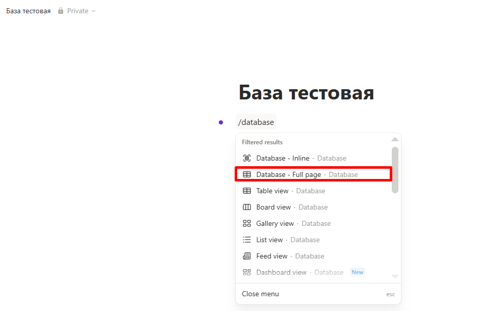
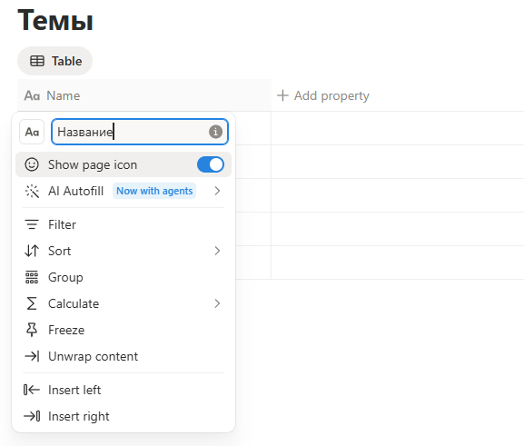
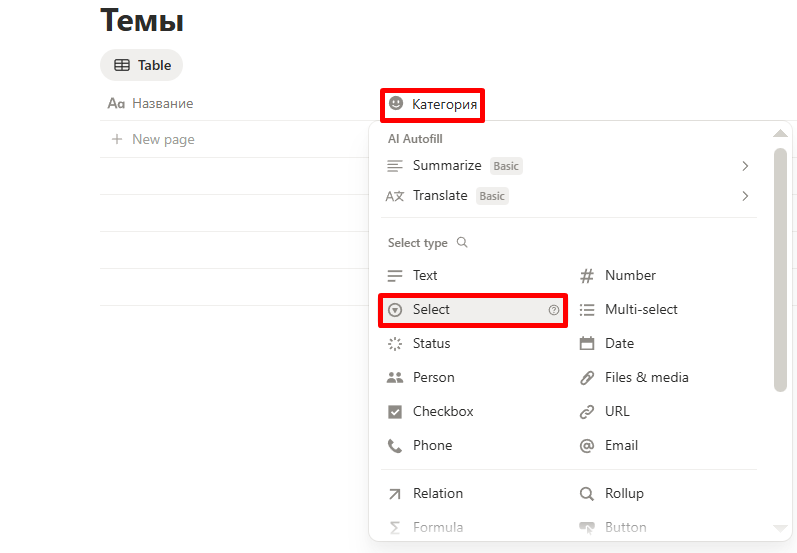
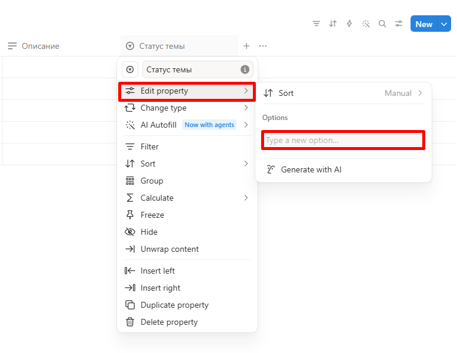
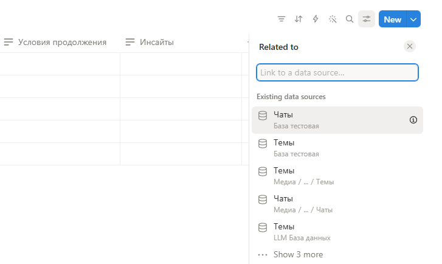
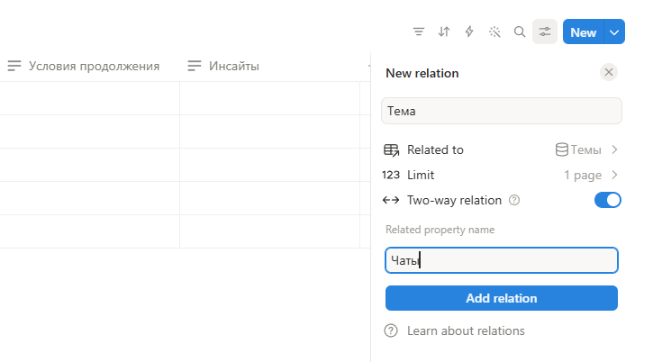
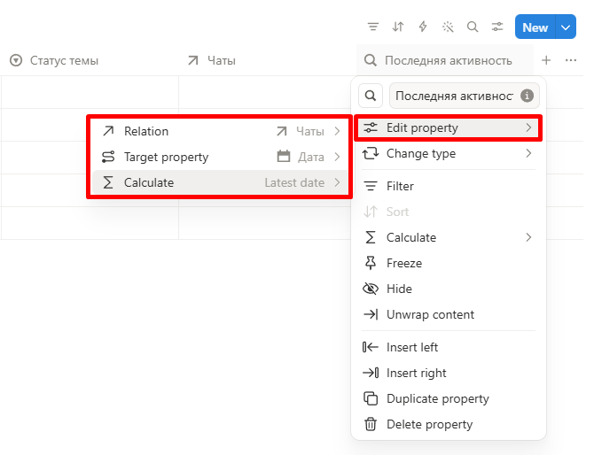

Базу диалогов можно создать с помощью разных программных продуктов. Ниже приведен пример ее реализации в Notion (1).
{ .annotate }

1.  Для российских IP сервис недоступен

#### I Создание страницы для базы

1. Авторизуйтесь в Notion.

2. В боковой панели наведите мышь на раздел, в котором хотите разместить базу, и нажмите кнопку **+**.

3. Введите название страницы (например, «База диалогов с LLM») и нажмите ++enter++. Если страница открыта не на весь экран, нажмите ++ctrl+enter++.

#### II Создание таблицы «Темы»

1. В первой строке страницы введите команду `/database` и в выпадающем списке выберите **Database - Full page**.

    <!-- --> 

    /// caption
    
    Создание таблицы БД
    ///

2. В пустом поле в заголовке страницы введите название «Темы».

3. Кликните по наименованию первой колонки и измените «Name» на «Название».

    <!-- --> 

    /// caption
    
    Переименование колонки
    ///

4. Кликните по кнопке **+ Add property** справа от первой колонки. В попапе введите название («Категория») и выберите тип данных (Select).

    <!-- --> 

    /// caption
    
    Создание колонки
    ///

5. Аналогичным образом создайте остальные колонки:

    * «Теги» (тип Multi‑select);

    * «Описание» (тип Text);
    
    * «Статус темы» (тип Select).

6. Кликните по наименованию колонки «Статус темы».

7. В открывшемся меню нажмите **Edit property**, затем выберите **Add an option**.

    <!-- --> 

    /// caption
    
    Создание значения для колонки с типом Select
    ///

8. Введите «Активна» и нажмите ++enter++.

9. Аналогичным образом создайте значения «На паузе» и «Завершена».

!!! info "Пояснение"
    Поля «Чаты» и «Последняя активность» невозможно настроить до создания второй таблицы, поэтому они добавляются позже.

#### III Создание таблицы «Чаты»

1. Вернитесь на родительскую страницу, созданную на этапе I.

2. В пустой строке введите команду `/database` и в выпадающем списке выберите **Database - Full page**.

3. В пустом поле в заголовке страницы введите название «Чаты».

4. Кликните по наименованию первой колонки и измените «Name» на «Название».

5. Создайте следующие колонки:

    * «Описание» (тип Text);

    * «LLM» (тип Select);

    * «Ссылка» (тип URL);

    * «Дата» (тип Date);

    * «Статус чата» (тип Select);

    * «Условия продолжения» (тип Text);

    * «Инсайты» (тип Text).

6. Кликните по наименованию колонки «Статус чата».

7. В открывшемся меню нажмите **Edit property**, затем выберите **Add an option**.

8. Введите «Активен» и нажмите ++enter++.

9. Аналогичным образом создайте значения «На паузе» и «Завершен».

!!! info "Пояснение"
    Поле «Содержание» не создается в виде отдельной колонки. Для хранения текста чата используется тело страницы каждой записи.

#### IV Настройка связей между таблицами

Если вы перешли на другую страницу, вернитесь на страницу «Чаты».

1. Кликните по кнопке **+ Add property**. В попапе введите название («Тема») и выберите тип данных (Relation).

2. В выпадающем списке выберите ранее созданную таблицу «Темы».

    <!-- --> 

    /// caption
    
    Создание связи между таблицами
    ///

3. Настройте параметры двунаправленной связи:

    * «Limit»  — выберите «1 page»;

    * «Two-way relation» — активируйте свитч;

    * «Related property»  — введите «Чаты».

    <!-- --> 

    /// caption
    
    Настройка связи между таблицами
    ///

4. Нажмите кнопку **Add relation**.

5. Перетащите колонку «Тема» справа от колонки «Название».

6. Перейдите на страницу таблицы «Темы».

7. Кликните по кнопке **+ Add property**. В попапе введите название («Последняя активность») и выберите тип данных (Rollup).

8. Кликните по наименованию колонки «Последняя активность».

9. В открывшемся меню нажмите **Edit property**, затем в поле «Relation» выберите «Чаты».

10. В поле «Target property» выберите «Дата».

11. В поле «Calculate» наведите мышь на «Date» и выберите «Latest date».

    <!-- --> 

    /// caption
    
    Настройка расчета последней активности
    ///

#### V Проверка работоспособности 

Если вы перешли на другую страницу, вернитесь на страницу «Темы».

1. Создайте по одному тестовому значению в полях «Категория» и «Теги».

2. Заполните вручную поля «Название», «Категория», «Теги», «Описание» и «Статус темы».

3. Перейдите на страницу «Чаты».

4. Создайте для поля «LLM» тестовое значение.

5. В поле «Тема» выберите тестовую запись, созданную в таблице «Темы».

6. Заполните вручную поля «Название», «Описание», «LLM», «Ссылка», «Дата», «Статус чата», «Условия продолжения», «Инсайты».

7. Вернитесь в таблицу «Темы» и убедитесь, что поле «Чаты» у тестовой темы заполнилось ссылкой на созданный чат, а в поле «Последняя активность» отображается дата, равная дате создания чата.

8. Удалите тестовые записи в обеих таблицах.