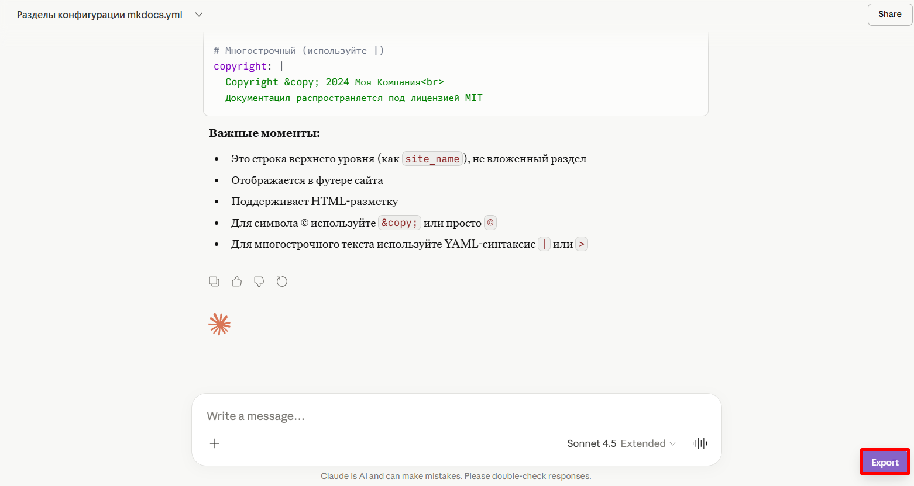
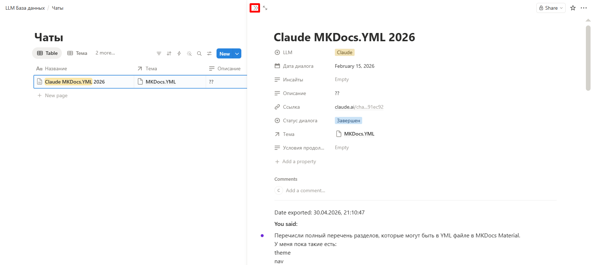

Рассмотрим хорошие практики работы с созданной базой, которые позволят ей оставаться удобной и полезной.

#### 1. Категоризация тем

Перед внесением первых записей проанализируйте свои прошлые диалоги с LLM. Ответьте для себя на вопросы:

* Какие предметные области для меня наиболее важны?

* Какие классы задач я чаще всего решаю с помощью LLM?

Выделите 5–10 категорий, наиболее актуальных для вас, и добавьте их в поле «Категория» в таблице «Темы». 

#### 2. Первичное заполнение базы

Внесите в базу существующие чаты, создав необходимые записи в таблицах «Темы» и «Чаты»:

* В случае, если у вас уже много чатов, добавьте только наиболее актуальные, а остальные вносите по мере необходимости;

* Поля «Название» (для темы и для чата), «Условия продолжения», «Инсайты» заполняются по правилам, приведенным в [пункте 3](knowledge-registry.md#3-правила-заполнения-некоторых-полей);

* Постепенно расширяйте перечень тегов, но постарайтесь, чтобы их количество не превысило 40–50.

Используйте удачные формулировки, инсайты и саммари из базы при формировании новых промптов ([шаг 1 Методики](LLM-general-instruction.md#1-формирование-первичного-промпта)).

#### 3. Правила заполнения некоторых полей

* При заполнении поля «Название» в таблице «Темы» используйте уникальные названия, отражающие суть задачи:

    !!! example "Хороший пример"
        Анализ причин церковного раскола в 1054 г.

    !!! failure "Плохой пример"
        Помощь по истории

* Поле «Название» в таблице «Чаты» заполняйте по следующему принципу: [«Название темы» «LLM» «Год»]. Например, для темы «Изучение Git» чат может называться «Изучение Git Claude 2026»;

* В поле «Условия продолжения» укажите событие из реального мира, наступление которого должно стать триггером для возобновления чата. Заполняйте это поле только для чатов со статусом «На паузе»:

    !!! example "Хороший пример"
        Получение ответа визового центра

    !!! failure "Плохой пример"
        Когда будет больше времени

* В поле «Инсайты» кратко перечислите важнейшие выводы и открытия, которые были получены в процессе ведения текущего диалога. 

    !!! example "Хороший пример"
        1. В Word следует создавать свои шаблоны под сложные документы вместо использования шаблона Normal. 
        2. Свой набор экспресс-блоков можно переслать другому человеку.

    !!! failure "Плохой пример"
        Рассмотрели, как лучше работать в Word

#### 4. Актуализация данных в базе

* Заносите в базу новые чаты регулярно (например, раз в неделю) или сразу после завершения работы с ними;

* Актуализируйте поля для тех тем и чатов, к которым возвращались с момента последнего обновления;

* Для чатов, переходящих на статус «На паузе», обязательно заполняйте поле «Условия продолжения»;

* Для наиболее важных чатов сохраняйте их полный текст. Экспорт текста осуществляется по инструкции, приведенной в [пункте 5](knowledge-registry.md#5-сохранение-текстов-чатов).

#### 5. Сохранение текстов чатов

Для сохранения полного текста чата можно воспользоваться плагином [**AI Chat Exporter Pro**](https://chatexport.workpent.com/)(1):
{ .annotate }

1.  Доступен для Google Chrome, Firefox и Edge

<!-- --> 

1. Установите и активируйте плагин, воспользовавшись инструкцией разработчиков.

2. Перейдите на страницу чата, текст которого хотите сохранить.

3. Нажмите кнопку **Export** в правом нижнем углу.

    <!-- --> 

    /// caption
    
    Кнопка Export
    ///

4. Настройте параметры экспорта:

    * «File type» — выберите «Markdown (MD)»;

    * «Title» — очистите поле. 

    !!! warning "Ограничение"
        Изображения, загруженные в чат вручную, при экспорте в Markdown не сохраняются. Если их наличие критично, выгрузите чат в формате DOCX или PDF — файл можно сохранить локально или прикрепить к записи в базе. В бесплатной версии Notion действует ограничение на загрузку файлов до 5 МБ.

5. Нажмите кнопку **Export now**.

6. Дождитесь окончания формирования файла и нажмите кнопку **Download**.

7. Перейдите в таблицу «Чаты».

8. Наведите мышь на название записи и нажмите кнопку **Open**.

9. Вставьте содержимое скачанного файла на страницу записи, при необходимости заменив существующий текст.

10. Закройте страницу, нажав кнопку **Close** в левом верхнем углу страницы.

    <!-- --> 

    /// caption
    
    Кнопка Close
    ///