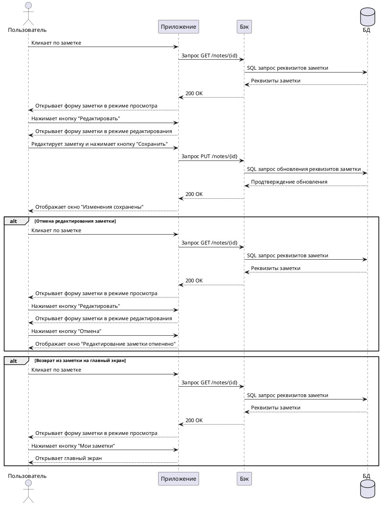

---
tags:
  - help
---
--8<-- "source:test_snippet"

## **Действующие лица**

1. Пользователь

2. Приложение

3. Бэк

4. База данных

## **Предварительные условия**

1. Пользователь находится на главном экране приложения.

2. Существует хотя бы одна ранее созданная заметка.

## **Выходные условия**

Содержание ранее созданной заметки изменено. Пользователь находится в окне уведомления об изменении заметки. 

## **Основной сценарий**

1. Пользователь кликает по ранее созданной заметке.

2. Приложение отправляет бэку запрос GET /notes/{id} на открытие заметки.

3. Бэк отправляет SQL-запрос к базе данных на получение реквизитов заметки.

4. База данных направляет бэку ответ, содержащий реквизиты открываемой заметки.

5. Бэк направляет приложению ответ, содержащий реквизиты открываемой заметки.

6. Приложение отображает форму заметки в режиме просмотра. На форме присутствуют кнопки **Редактировать**, **Удалить**, **Мои заметки**.

7. Пользователь нажимает кнопку **Редактировать**.

8. Приложение отображает форму заметки в режиме редактирования. На форме присутствуют кнопки **Сохранить**, **Отмена**.

9. Пользователь редактирует текст заметки и нажимает кнопку **Сохранить**.

10. Приложение отправляет бэку запрос PUT /notes/{id} на обновление заметки.

11. Бэк отправляет SQL-запрос к базе данных, содержащий реквизиты измененной заметки.

12. База данных направляет бэку ответ, содержащий подтверждение успешного обновление данных.

13. Бэк направляет приложению ответ, содержащий подтверждение успешного обновление данных в базе данных.

14. Приложение отображает окно "Изменения сохранены!". В окне доступны кнопки **Мои заметки** и **Создать новую**.

## **Альтернативный сценарий № 1**

1. Пользователь кликает по ранее созданной заметке.

2. Приложение отправляет бэку запрос GET /notes/{id} на открытие заметки.

3. Бэк отправляет SQL-запрос к базе данных на получение реквизитов заметки.

4. База данных направляет бэку ответ, содержащий реквизиты открываемой заметки.

5. Бэк направляет приложению ответ, содержащий реквизиты открываемой заметки.

6. Приложение отображает форму заметки в режиме просмотра. На форме присутствуют кнопки **Редактировать**, **Удалить**, **Мои заметки**.

7. Пользователь нажимает кнопку **Редактировать**.

8. Приложение отображает форму заметки в режиме редактирования. На форме присутствуют кнопки **Сохранить**, **Отмена**.

9. Пользователь нажимает кнопку **Отмена**.

10. Приложение отображает окно "Редактирование заметки отменено". В окне доступны кнопки **Мои заметки** и **Создать новую**.

## **Альтернативный сценарий № 2**

1. Пользователь кликает по ранее созданной заметке.

2. Приложение отправляет бэку запрос GET /notes/{id} на открытие заметки.

3. Бэк отправляет SQL-запрос к базе данных на получение реквизитов заметки.

4. База данных направляет бэку ответ, содержащий реквизиты открываемой заметки.

5. Бэк направляет приложению ответ, содержащий реквизиты открываемой заметки.

6. Приложение отображает форму заметки в режиме просмотра. На форме присутствуют кнопки **Редактировать**, **Удалить**, **Мои заметки**.

7. Пользователь нажимает кнопку **Мои заметки**.

8. Приложение отображает главный экран без изменений.

## **Диаграмма последовательности**

Диаграмма построена с использованием инструмента [PlantUML](https://www.plantuml.com)


??? note "Код диаграммы"
    
    ```
    
    @startuml
    actor Пользователь
    participant Приложение
    participant Бэк
    database БД
    Пользователь -> Приложение: Кликает по заметке
    Приложение -> Бэк: Запрос GET /notes/{id}
    Бэк -> БД: SQL запрос реквизитов заметки
    Бэк <-- БД: Реквизиты заметки
    Приложение <-- Бэк: 200 OK
    Пользователь <-- Приложение: Открывает форму заметки в режиме просмотра
    Пользователь -> Приложение: Нажимает кнопку "Редактировать"
    Пользователь <-- Приложение: Открывает форму заметки в режиме редактирования
    Пользователь -> Приложение: Редактирует заметку и нажимает кнопку "Сохранить"
    Приложение -> Бэк: Запрос PUT /notes/{id}
    Бэк -> БД: SQL запрос обновления реквизитов заметки
    Бэк <-- БД: Продтверждение обновления
    Приложение <-- Бэк: 200 OK
    Пользователь <-- Приложение: Отображает окно "Изменения сохранены"

    alt Отмена редактирования заметки
    Пользователь -> Приложение: Кликает по заметке
    Приложение -> Бэк: Запрос GET /notes/{id}
    Бэк -> БД: SQL запрос реквизитов заметки
    Бэк <-- БД: Реквизиты заметки
    Приложение <-- Бэк: 200 OK
    Пользователь <-- Приложение: Открывает форму заметки в режиме просмотра
    Пользователь -> Приложение: Нажимает кнопку "Редактировать"
    Пользователь <-- Приложение: Открывает форму заметки в режиме редактирования
    Пользователь -> Приложение: Нажимает кнопку "Отмена"
    Пользователь <-- Приложение: Отображает окно "Редактирование заметки отменено"
    end alt

    alt Возврат из заметки на главный экран
    Пользователь -> Приложение: Кликает по заметке
    Приложение -> Бэк: Запрос GET /notes/{id}
    Бэк -> БД: SQL запрос реквизитов заметки
    Бэк <-- БД: Реквизиты заметки
    Приложение <-- Бэк: 200 OK
    Пользователь <-- Приложение: Открывает форму заметки в режиме просмотра
    Пользователь -> Приложение: Нажимает кнопку "Мои заметки"
    Пользователь <-- Приложение: Открывает главный экран
    end alt
    @enduml

    ```

