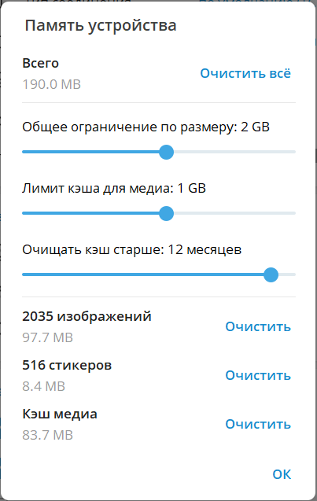

---
tags:
  - help
---

Эта инструкция создана в рамках мастер-класса по docs as code.

В Desktop-приложении Telegram реализована возможность настройки параметров локального кэширования файлов.

Для управления кэшем Telegram необходимо выполнить следующие действия:

1. На сайдбаре нажать кнопку «три полоски». Откроется главное меню приложения.

2. В главном меню перейти в раздел «Настройки». Откроется модальное окно «Настройки».

3. В окне настроек перейти в раздел «Продвинутые настройки». Откроется страница продвинутых настроек, содержащая блок «Данные и память».

4. В блоке «Данные и память» выбрать пункт «Управление памятью устройства». Откроется модальное окно «Память устройства».

??? note "Модальное окно «Память устройства»"
    

В окне памяти устройства доступны возможности:

**Полная очистка кэша**

Для полной очистки кэша необходимо нажать кнопку «Очистить все» и дождаться завершения процедуры.

**Настройка лимитов кэша**

Настройка лимитов кэша осуществляется с помощью трех ползунков:

* «Общее ограничение по размеру» – позволяет выбрать максимальный объем кэша. При превышении кэшем данного размера приложение автоматически удаляет файлы, к которым дольше всего не обращались;

* «Лимит кэша для медиа» – позволяет выбрать максимальный объем кэша отдельно для медиафайлов (изображения, видео);

* «Очищать кэш старше» – позволяет выбрать временной период хранения файлов кэша. Все файлы, хранящиеся дольше этого времени, будут удалены автоматически. Доступна опция «Никогда».

**Очистка кэша разных видов**

Для очистки кэша по отдельному виду данных необходимо нажать кнопку «Очистить» в соответствующей строке.

*Для сохранения внесенных изменений необходимо нажать кнопку «Ок».*
