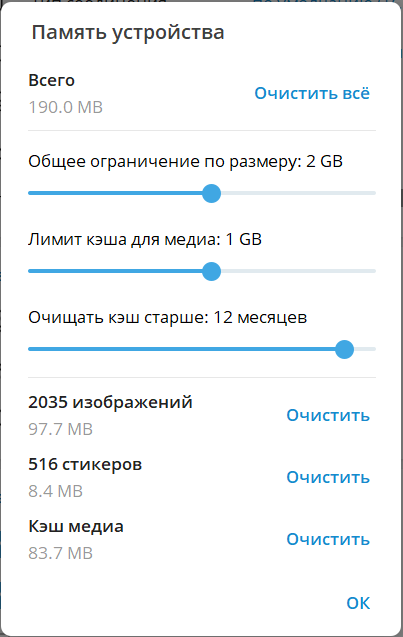

---
tags:
  - help
---

--8<-- "source:test_snippet"

В Desktop-приложении Telegram реализована возможность настройки параметров локального кэширования файлов (1).
{ .annotate }

1.  В Windows кэш хранится в папке C:\Users\<Имя пользователя>\Downloads\Telegram Desktop

#### **1. Просмотр параметров кэширования**

Для управления кэшем Telegram выполните следующие действия:

1. На сайдбаре нажмите кнопку **три полоски**. Откроется главное меню приложения.

2. В главном меню перейдите в раздел «Настройки». Откроется модальное окно «Настройки».

3. В окне настроек перейдите в раздел «Продвинутые настройки». Откроется страница продвинутых настроек, содержащая блок «Данные и память».

4. В блоке «Данные и память» выберите пункт «Управление памятью устройства». Откроется модальное окно «Память устройства».

<!-- --> 

/// caption

Модальное окно «Память устройства»
///

#### **2. Управление параметрами кэширования**

В окне памяти устройства доступны возможности:

**Полная очистка кэша**

Для полной очистки кэша нажмите кнопку **Очистить все** и дождитесь завершения процедуры.

**Настройка лимитов кэша**

Настройка лимитов кэша осуществляется с помощью трех ползунков:

* «Общее ограничение по размеру» – позволяет выбрать максимальный объем кэша. При превышении кэшем данного размера приложение автоматически удаляет файлы, к которым дольше всего не обращались;

* «Лимит кэша для медиа» – позволяет выбрать максимальный объем кэша отдельно для медиафайлов (изображения, видео);

* «Очищать кэш старше» – позволяет выбрать временной период хранения файлов кэша. Все файлы, хранящиеся дольше этого времени, будут удалены автоматически. Доступна опция «Никогда».

**Очистка кэша разных видов**

Для очистки кэша по отдельному виду данных нажмите кнопку **Очистить** в соответствующей строке.

**Сохранение изменений**

Для сохранения внесенных изменений нажмите кнопку **Ок**.